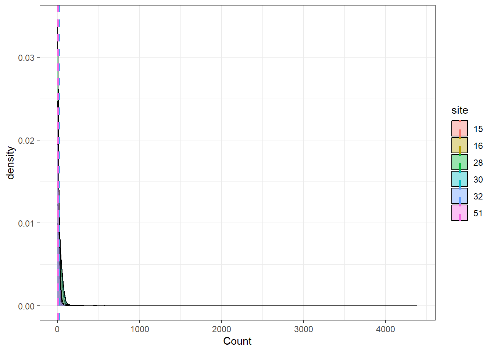
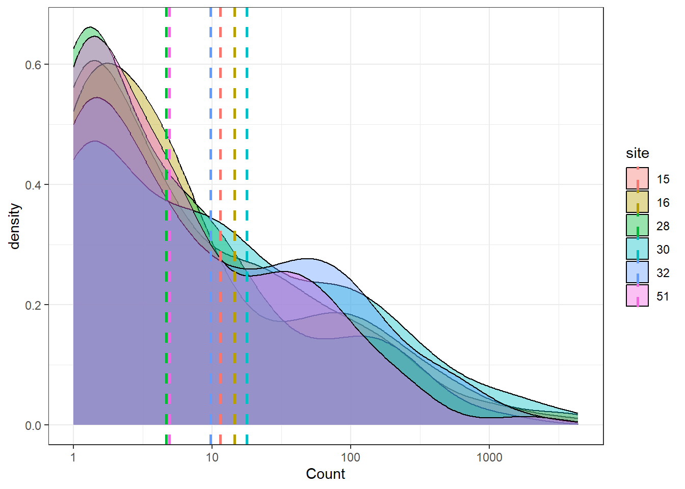
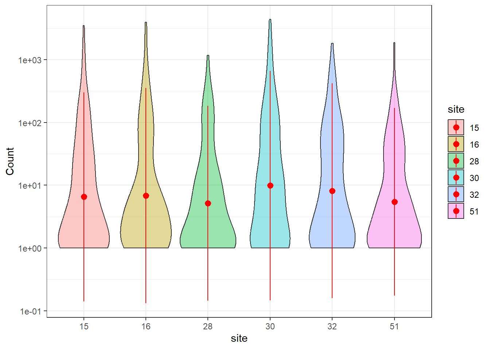
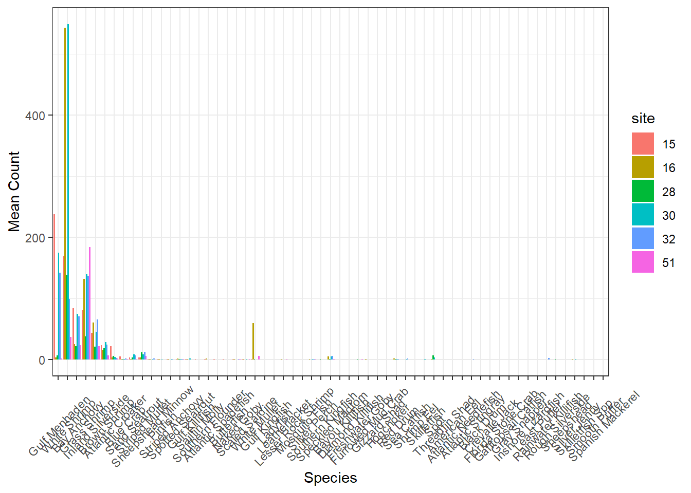
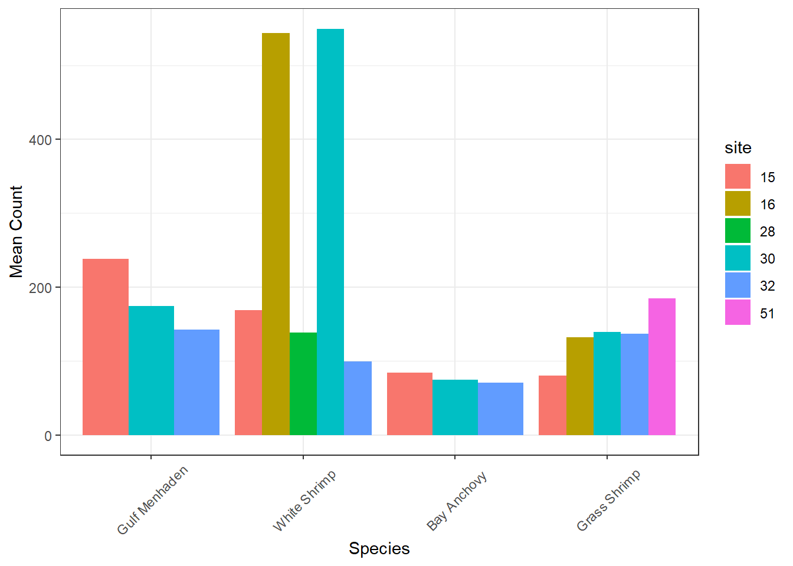
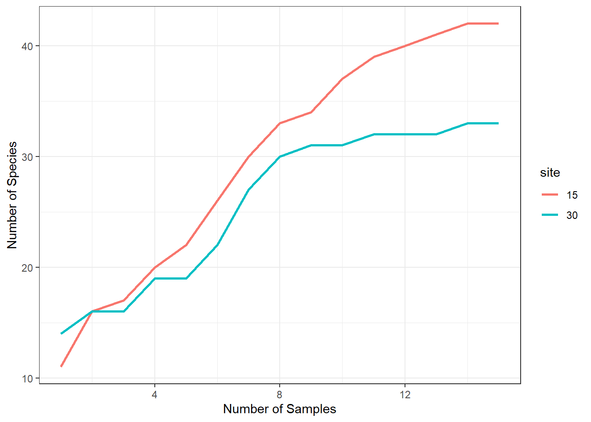
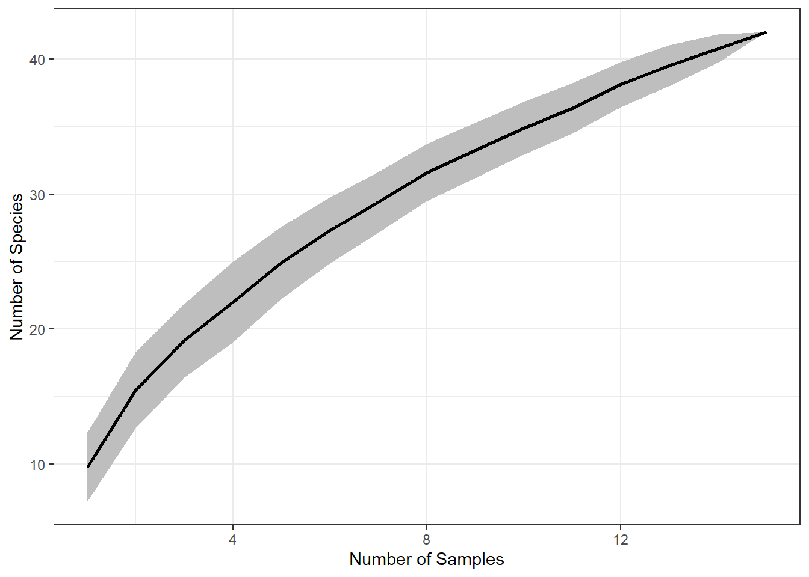
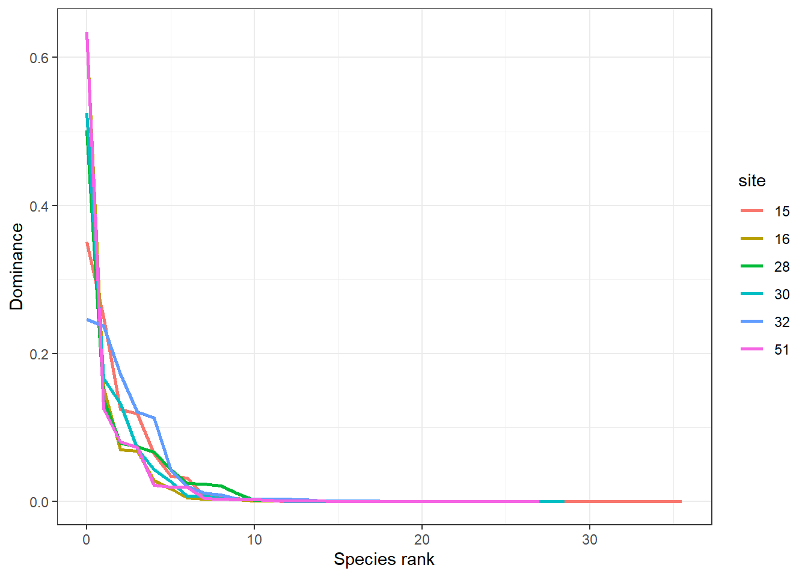
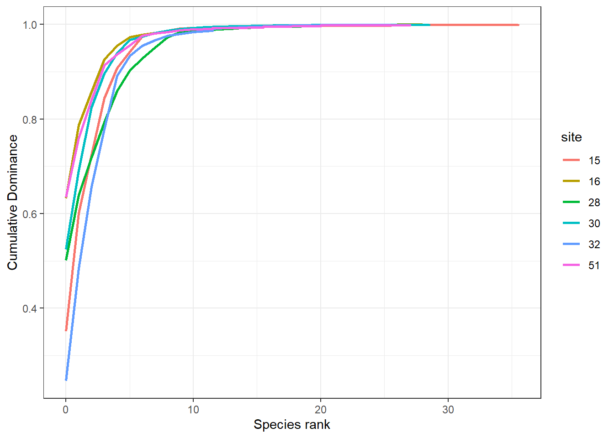

This workshop discusses working with community data.\

R script: [github](https://github.com/SeascapeEcologyLab-workshops/BSC6926-B52_Fall2024/blob/main/workshopScripts/workshop7.R)

[R script of workshop 7](workshopScripts/workshop7.R)

[data](https://github.com/SeascapeEcologyLab-workshops/BSC6926-B52_Fall2024/blob/main/data/Calcasieu.csv)


## Community Data
Community data can vary in format, but typically involves abundance, biomass, or CPUE data for multiple species collected in each sample. Data can be stored in wide (species ID for each column) or long format. When examining community data, the first step is usually data exploration which can be done by calculating summary statistics or plotting.


::: {.cell}

```{.r .cell-code}
library(tidyverse)
## ── Attaching core tidyverse packages ──────────────────────── tidyverse 2.0.0 ──
## ✔ dplyr     1.1.4     ✔ readr     2.1.5
## ✔ forcats   1.0.0     ✔ stringr   1.5.1
## ✔ ggplot2   3.5.1     ✔ tibble    3.2.1
## ✔ lubridate 1.9.3     ✔ tidyr     1.3.1
## ✔ purrr     1.0.2     
## ── Conflicts ────────────────────────────────────────── tidyverse_conflicts() ──
## ✖ dplyr::filter() masks stats::filter()
## ✖ dplyr::lag()    masks stats::lag()
## ℹ Use the conflicted package (<http://conflicted.r-lib.org/>) to force all conflicts to become errors

# data in wide format
marsh_w = read_csv('data/Calcasieu.csv') |> 
  mutate(site = as.character(site),
         month = month(date)) 
## Rows: 90 Columns: 62
## ── Column specification ────────────────────────────────────────────────────────
## Delimiter: ","
## chr   (1): basin
## dbl  (60): site, Speckled Madtom, Sailfin Molly, Blue Crab, Atlantic Croaker...
## date  (1): date
## 
## ℹ Use `spec()` to retrieve the full column specification for this data.
## ℹ Specify the column types or set `show_col_types = FALSE` to quiet this message.

marsh_w
## # A tibble: 90 × 63
##    site  date       basin     `Speckled Madtom` `Sailfin Molly` `Blue Crab`
##    <chr> <date>     <chr>                 <dbl>           <dbl>       <dbl>
##  1 15    2007-01-10 Calcasieu                 2               1          10
##  2 15    2007-02-22 Calcasieu                 0               0           0
##  3 15    2007-03-02 Calcasieu                 0               0          19
##  4 15    2007-04-11 Calcasieu                 0               2          23
##  5 15    2007-06-05 Calcasieu                 0               0           0
##  6 15    2007-07-24 Calcasieu                 0               0           3
##  7 15    2007-08-07 Calcasieu                 0               0           6
##  8 15    2007-09-20 Calcasieu                 0               0           0
##  9 15    2007-09-27 Calcasieu                 0               0           0
## 10 15    2007-10-03 Calcasieu                 0               0           0
## # ℹ 80 more rows
## # ℹ 57 more variables: `Atlantic Croaker` <dbl>, `Gulf Menhaden` <dbl>,
## #   `Grass Shrimp` <dbl>, `Striped Mullet` <dbl>, `Inland Silverside` <dbl>,
## #   `Sheepshead Minnow` <dbl>, `Gulf Killifish` <dbl>, `Freshwater Goby` <dbl>,
## #   `Mosquito Fish` <dbl>, `White Shrimp` <dbl>, `Bay Anchovy` <dbl>,
## #   `Southern Flounder` <dbl>, `Diamond Killifish` <dbl>, `Naked Goby` <dbl>,
## #   `Brown Shrimp` <dbl>, `Sand Seatrout` <dbl>, Pinfish <dbl>, …

# convert to long format for plotting
marsh_l = marsh_w |> 
  pivot_longer(cols = 4:62, 
               names_to = "Species", 
               values_to = "Count") 

marsh_l
## # A tibble: 5,310 × 6
##    site  date       basin     month Species           Count
##    <chr> <date>     <chr>     <dbl> <chr>             <dbl>
##  1 15    2007-01-10 Calcasieu     1 Speckled Madtom       2
##  2 15    2007-01-10 Calcasieu     1 Sailfin Molly         1
##  3 15    2007-01-10 Calcasieu     1 Blue Crab            10
##  4 15    2007-01-10 Calcasieu     1 Atlantic Croaker     47
##  5 15    2007-01-10 Calcasieu     1 Gulf Menhaden         5
##  6 15    2007-01-10 Calcasieu     1 Grass Shrimp        134
##  7 15    2007-01-10 Calcasieu     1 Striped Mullet        2
##  8 15    2007-01-10 Calcasieu     1 Inland Silverside    50
##  9 15    2007-01-10 Calcasieu     1 Sheepshead Minnow    10
## 10 15    2007-01-10 Calcasieu     1 Gulf Killifish        1
## # ℹ 5,300 more rows
```
:::


### Calculate summary statistics


::: {.cell}

```{.r .cell-code}
marsh_ss = marsh_l |> 
  group_by(site) |> 
  summarise(mean_count = mean(Count, na.rm = TRUE),
            sd_count = sd(Count, na.rm = TRUE),
            total = sum(Count, na.rm = TRUE)) 

marsh_ss
## # A tibble: 6 × 4
##   site  mean_count sd_count total
##   <chr>      <dbl>    <dbl> <dbl>
## 1 15         11.5     132.  10169
## 2 16         14.5     165.  12876
## 3 28          4.68     46.7  4138
## 4 30         17.7     178.  15697
## 5 32          9.78     77.9  8651
## 6 51          4.92     66.0  4358
```
:::


### Plot density of Abundance


::: {.cell}

```{.r .cell-code}
ggplot(marsh_l, aes(x = Count, fill = site))+
  geom_density(alpha=0.4) +
  geom_vline(data=marsh_ss, aes(xintercept=mean_count, color=site),
             linetype="dashed", linewidth = 1) +
  theme_bw()
```

::: {.cell-output-display}
{width=672}
:::

```{.r .cell-code}

# change scale of axis
ggplot(marsh_l, aes(x = Count, fill = site))+
  geom_density(alpha=0.4) +
  geom_vline(data=marsh_ss, aes(xintercept=mean_count, color=site),
             linetype="dashed", linewidth = 1) +
  scale_x_log10()+
  theme_bw()
## Warning in scale_x_log10(): log-10 transformation introduced infinite values.
## Warning: Removed 4530 rows containing non-finite outside the scale range
## (`stat_density()`).
```

::: {.cell-output-display}
{width=672}
:::
:::


### Violin plot of abundance


::: {.cell}

```{.r .cell-code}
ggplot(marsh_l, aes(x = site, y = Count, fill = site))+
  geom_violin(alpha=0.4) +
  stat_summary(fun.data=mean_sdl, mult=1, 
               geom="pointrange", color="red") +
  scale_y_log10()+
  theme_bw()
## Warning in stat_summary(fun.data = mean_sdl, mult = 1, geom = "pointrange", :
## Ignoring unknown parameters: `mult`
## Warning in scale_y_log10(): log-10 transformation introduced infinite values.
## log-10 transformation introduced infinite values.
## Warning: Removed 4530 rows containing non-finite outside the scale range
## (`stat_ydensity()`).
## Warning: Removed 4530 rows containing non-finite outside the scale range
## (`stat_summary()`).
```

::: {.cell-output-display}
{width=672}
:::
:::


## Summarize and plot by species


::: {.cell}

```{.r .cell-code}
marsh_summary2 = marsh_l |> 
  group_by(site, Species) |> 
  summarise(mean_count = mean(Count, na.rm = TRUE),
            sd_count = sd(Count, na.rm = TRUE),
            total = sum(Count, na.rm = TRUE)) |> 
  mutate(Species = fct_reorder(Species, mean_count, .desc = TRUE))
## `summarise()` has grouped output by 'site'. You can override using the
## `.groups` argument.

ggplot(marsh_summary2, aes(x = Species, y = mean_count, fill = site))+
  geom_bar(stat = "identity", position=position_dodge()) + 
  labs(y = 'Mean Count', x = 'Species', fill = 'site')+
  theme_bw() +
  theme(axis.text.x = element_text(angle = 45, vjust = 0.5))
```

::: {.cell-output-display}
{width=672}
:::

```{.r .cell-code}

# filter to only top species
ggplot(marsh_summary2 |> filter(total > 1000), aes(x = Species, y = mean_count, fill = site))+
  geom_bar(stat = "identity", position=position_dodge()) + 
  labs(y = 'Mean Count', x = 'Species', fill = 'site')+
  theme_bw() +
  theme(axis.text.x = element_text(angle = 45, vjust = 0.5))
```

::: {.cell-output-display}
{width=672}
:::
:::


## Diversity metrics
Community data due to its multidimensionality is difficulty to interpret. Researchers have developed different indices and metrics to provide information about the biodiversity of the community data.

## Species Richness
Species richness ($S$) is the total number of species. 


::: {.cell}

```{.r .cell-code}
marsh_l |> 
  group_by(site, month) |> 
  filter(Count > 0) |> 
  summarise(richness = length(unique(Species))) |> 
  ungroup() |> 
  group_by(site) |> 
  summarise(mean_richness = mean(richness, na.rm = TRUE),
            sd_richness = sd(richness, na.rm = TRUE))
## `summarise()` has grouped output by 'site'. You can override using the
## `.groups` argument.
## # A tibble: 6 × 3
##   site  mean_richness sd_richness
##   <chr>         <dbl>       <dbl>
## 1 15            11.5         2.66
## 2 16            10.9         2.39
## 3 28             8           2.66
## 4 30            10.4         2.97
## 5 32            10.4         3.48
## 6 51             8.09        3.24
```
:::


## Shannon 
The Shannon diversity index ($H'$) is a diversity metric that accounts for species proportions and is calculated with the following formula: 
$$H' = -\sum_{i=1}^S p_i \log(p_i)$$
where $p_i$ is the proportion of species $i$. The higher the value of $H'$, the higher the diversity of species in a particular community. The lower the value of H, the lower the diversity. A value of $H'$ = 0 indicates a community that only has one species.


::: {.cell}

```{.r .cell-code}
# for loop
df = unique(marsh_l[c("site","month")])
df$H = NA

df
## # A tibble: 69 × 3
##    site  month H    
##    <chr> <dbl> <lgl>
##  1 15        1 NA   
##  2 15        2 NA   
##  3 15        3 NA   
##  4 15        4 NA   
##  5 15        6 NA   
##  6 15        7 NA   
##  7 15        8 NA   
##  8 15        9 NA   
##  9 15       10 NA   
## 10 15       11 NA   
## # ℹ 59 more rows

for (i in 1:nrow(df)){
  d = marsh_l |> filter(site == df$site[i],
                          month == df$month[i],
                          Count > 0)
  d = d |> count(Species,wt = Count) |> 
    mutate(pi = n/sum(n),
           ln_pi = log(pi),
           p_ln_pi = pi*ln_pi)
  
  df$H[i] = -sum(d$p_ln_pi)
}

df
## # A tibble: 69 × 3
##    site  month     H
##    <chr> <dbl> <dbl>
##  1 15        1 1.43 
##  2 15        2 0.405
##  3 15        3 1.28 
##  4 15        4 0.978
##  5 15        6 1.46 
##  6 15        7 1.39 
##  7 15        8 1.68 
##  8 15        9 1.15 
##  9 15       10 0.915
## 10 15       11 0.360
## # ℹ 59 more rows

df |> 
  group_by(site) |> 
  summarise(mean_H = mean(H, na.rm = TRUE),
            sd_H = sd(H, na.rm = TRUE))
## # A tibble: 6 × 3
##   site  mean_H  sd_H
##   <chr>  <dbl> <dbl>
## 1 15     1.16  0.464
## 2 16     1.02  0.384
## 3 28     0.956 0.451
## 4 30     0.941 0.475
## 5 32     1.08  0.411
## 6 51     1.06  0.433


# dplyr
marsh_l |> 
  group_by(site, month) |> 
  filter(Count > 0) |> 
  mutate(Total = sum(Count)) |> 
  ungroup() |> 
  group_by(site, month, Species) |>
  summarise(Count_Spp = sum(Count),
            Total_Count = max(Total)) |> 
  mutate(p = Count_Spp/Total_Count, 
         ln_pi = log(p), 
         p_ln_pi = p*ln_pi) |> 
  ungroup() |> 
  group_by(site, month) |> 
  summarise(H = -sum(p_ln_pi)) |> 
  ungroup() |> 
  group_by(site) |> 
  summarise(mean_H = mean(H, na.rm = TRUE),
            sd_H = sd(H, na.rm = TRUE))
## `summarise()` has grouped output by 'site', 'month'. You can override using the
## `.groups` argument.
## `summarise()` has grouped output by 'site'. You can override using the
## `.groups` argument.
## # A tibble: 6 × 3
##   site  mean_H  sd_H
##   <chr>  <dbl> <dbl>
## 1 15     1.16  0.464
## 2 16     1.02  0.384
## 3 28     0.956 0.451
## 4 30     0.941 0.475
## 5 32     1.08  0.411
## 6 51     1.06  0.433
```
:::


## Simpson
Another popular set of indices are Simpson's indices. The Simpson index calculated is a dominance metric and is calculated
$$D = \sum_{i=1}^S p_i^2$$ It ranges between 0 and 1 with high values indicating that abundance is made up of a few species. Its counter part $1 - D$ is an evenness index. The inverse $1/D$ is an indication of the richness in a community with uniform evenness that would have the same level of diversity.


::: {.cell}

```{.r .cell-code}
# for loop
df$D = NA
df
## # A tibble: 69 × 4
##    site  month     H D    
##    <chr> <dbl> <dbl> <lgl>
##  1 15        1 1.43  NA   
##  2 15        2 0.405 NA   
##  3 15        3 1.28  NA   
##  4 15        4 0.978 NA   
##  5 15        6 1.46  NA   
##  6 15        7 1.39  NA   
##  7 15        8 1.68  NA   
##  8 15        9 1.15  NA   
##  9 15       10 0.915 NA   
## 10 15       11 0.360 NA   
## # ℹ 59 more rows

for (i in 1:nrow(df)){
  d = marsh_l |> filter(site == df$site[i],
                        month == df$month[i],
                        Count > 0)
  d = d |> count(Species,wt = Count) |> 
    mutate(pi = n/sum(n))
  
  df$D[i] = sum(d$pi^2)
}
df$even = 1 - df$D
df$inv = 1/df$D

df
## # A tibble: 69 × 6
##    site  month     H     D  even   inv
##    <chr> <dbl> <dbl> <dbl> <dbl> <dbl>
##  1 15        1 1.43  0.331 0.669  3.02
##  2 15        2 0.405 0.824 0.176  1.21
##  3 15        3 1.28  0.360 0.640  2.78
##  4 15        4 0.978 0.515 0.485  1.94
##  5 15        6 1.46  0.290 0.710  3.45
##  6 15        7 1.39  0.343 0.657  2.92
##  7 15        8 1.68  0.247 0.753  4.04
##  8 15        9 1.15  0.385 0.615  2.60
##  9 15       10 0.915 0.496 0.504  2.02
## 10 15       11 0.360 0.860 0.140  1.16
## # ℹ 59 more rows

df |> 
  group_by(site) |> 
  summarize(across(D:inv, list(mean = mean, sd = sd)))
## # A tibble: 6 × 7
##   site  D_mean  D_sd even_mean even_sd inv_mean inv_sd
##   <chr>  <dbl> <dbl>     <dbl>   <dbl>    <dbl>  <dbl>
## 1 15     0.444 0.216     0.556   0.216     2.68  1.04 
## 2 16     0.514 0.177     0.486   0.177     2.13  0.633
## 3 28     0.556 0.235     0.444   0.235     2.21  1.17 
## 4 30     0.568 0.217     0.432   0.217     2.06  0.926
## 5 32     0.481 0.188     0.519   0.188     2.43  1.07 
## 6 51     0.487 0.212     0.513   0.212     2.40  0.992

# dplyr
marsh_l |> 
  group_by(site, month) |> 
  filter(Count > 0) |> 
  mutate(Total = sum(Count)) |> 
  ungroup() |> 
  group_by(site, month, Species) |>
  summarize(Count_Spp = sum(Count),
            Total_Count = max(Total)) |> 
  mutate(p = Count_Spp/Total_Count, 
         p2 = p^2) |> 
  ungroup() |> 
  group_by(site, month) |> 
  summarise(s_dominance = sum(p2),
            s_evenness = 1 - s_dominance,
            inverse_s = 1/s_dominance) |> 
  group_by(site) |> 
  summarize(across(s_dominance:s_evenness, list(mean = mean, sd = sd)))
## `summarise()` has grouped output by 'site', 'month'. You can override using the
## `.groups` argument.
## `summarise()` has grouped output by 'site'. You can override using the
## `.groups` argument.
## # A tibble: 6 × 5
##   site  s_dominance_mean s_dominance_sd s_evenness_mean s_evenness_sd
##   <chr>            <dbl>          <dbl>           <dbl>         <dbl>
## 1 15               0.444          0.216           0.556         0.216
## 2 16               0.514          0.177           0.486         0.177
## 3 28               0.556          0.235           0.444         0.235
## 4 30               0.568          0.217           0.432         0.217
## 5 32               0.481          0.188           0.519         0.188
## 6 51               0.487          0.212           0.513         0.212
```
:::


## Species accumulation curves
Also called rarefaction curve, plots the number of species as a function of the number of samples.


::: {.cell}

```{.r .cell-code}
marsh_l = marsh_l |> 
  group_by(site, date) |> 
  mutate(sample_ID = cur_group_id()) |> 
  ungroup()

# curve for site 15
m15 = marsh_l |> 
  filter(site == '15')

m15_sample_ID  = unique(m15$sample_ID)

# store data
sp_m15 = tibble(site = '15', n_samp = 1:length(m15_sample_ID), n_spp = NA)

for (i in 1:length(m15_sample_ID)){
  # sample ID to include
  samp = m15_sample_ID[1:i]
  
  # include only sample numbers 
  d = m15 |> 
    filter(sample_ID %in% samp,
           Count > 0)
  
  sp_m15$n_spp[i] = length(unique(d$Species))
}

# curve for 30
m30 = marsh_l |> 
  filter(site == '30')

m30_sample_ID  = unique(m30$sample_ID)

# store data
sp_m30 = tibble(site = '30', n_samp = 1:length(m30_sample_ID), n_spp = NA)

for (i in 1:length(m30_sample_ID)){
  # sample ID to include
  samp = m30_sample_ID[1:i]
  
  # include only sample numbers 
  d = m30 |> 
    filter(sample_ID %in% samp,
           Count > 0)
  
  sp_m30$n_spp[i] = length(unique(d$Species))
}

# bind and plot
sac = bind_rows(sp_m15, sp_m30)

ggplot(sac, aes(n_samp, n_spp, color = site))+
  geom_line(linewidth = 1)+
  labs(x = 'Number of Samples',
       y = 'Number of Species',
       color = 'site')+
  theme_bw()
```

::: {.cell-output-display}
{width=672}
:::
:::


### Iterate and use based on random samples


::: {.cell}

```{.r .cell-code}
# curve for site 15
m15 = marsh_l |> 
  filter(site == '15')

m15_sample_ID  = unique(m15$sample_ID)

iterations = 50

# store data
sp_m15 = tibble(site = '15', 
               n_samp = rep(1:length(m15_sample_ID),times = iterations), 
               n_spp = NA,
               i = rep(1:iterations, each = length(m15_sample_ID)))

for (j in 1:iterations) {
  # create random sample order
  sID = sample(m15_sample_ID)
  for (i in 1:length(m15_sample_ID)) {
    # sample ID to include
    samp = sID[1:i]
    
    # include only sample numbers
    d = m15 |>
      filter(sample_ID %in% samp,
             Count > 0)
    
    sp_m15$n_spp[i+((j-1)*length(m15_sample_ID))] = length(unique(d$Species))
  }
}

avg = sp_m15 |> 
  group_by(n_samp) |> 
  summarize(m_spp = mean(n_spp, na.rm = T),
            sd_spp = sd(n_spp, na.rm = T))

ggplot(avg, aes(n_samp, m_spp))+
  geom_ribbon(aes(ymin = m_spp - sd_spp, ymax = m_spp + sd_spp),
              fill = 'grey')+
  geom_line(linewidth = 1)+
  labs(x = 'Number of Samples',
       y = 'Number of Species',
       color = 'site')+
  theme_bw()
```

::: {.cell-output-display}
{width=672}
:::
:::


## Dominance curves / Whittaker curves
Dominance as a function of species rank


::: {.cell}

```{.r .cell-code}
df = marsh_l |> 
    group_by(site) |> 
    filter(Count > 0) |> 
    mutate(Total = sum(Count)) |> 
    group_by(site, Species) |>
    summarise(Count_Spp = sum(Count),
              Total_Count = max(Total)) |> 
    mutate(p_i = Count_Spp/Total_Count, 
           rank = length(unique(Species))-rank(p_i)) |> 
    ungroup()
## `summarise()` has grouped output by 'site'. You can override using the
## `.groups` argument.

ggplot(df, aes(rank, p_i, color = site))+
  geom_line(linewidth = 1)+
  labs(x = 'Species rank',
       y = 'Dominance',
       color = 'site')+
  theme_bw()
```

::: {.cell-output-display}
{width=672}
:::
:::


## K-dominance curves
Cumulative dominance by species rank


::: {.cell}

```{.r .cell-code}
df = marsh_l |> 
    group_by(site) |> 
    filter(Count > 0) |> 
    mutate(Total = sum(Count)) |> 
    ungroup() |> 
    group_by(site, Species) |>
    summarise(Count_Spp = sum(Count),
              Total_Count = max(Total)) |> 
    mutate(p_i = Count_Spp/Total_Count, 
           rank = length(unique(Species))-rank(p_i)) |> 
    arrange(rank, .by_group = T) |> 
  mutate(cumsum = cumsum(p_i))
## `summarise()` has grouped output by 'site'. You can override using the
## `.groups` argument.

ggplot(df, aes(rank, cumsum, color = site))+
  geom_line(linewidth = 1)+
  labs(x = 'Species rank',
       y = 'Cumulative Dominance',
       color = 'site')+
  theme_bw()
```

::: {.cell-output-display}
{width=672}
:::
:::


## Exercises 
1. Using the Calcasieu seine dataset, calculate the species richness for each month at each month and plot over the year. 

2. Calculate the average Shannon and Simpson indeces for the fall (Sep-Nov) and Spring (March-May) for site 30. 

3. _Challenge_: Calculate the average species accumulation curve for site 16 and site 28. Plot your results.
